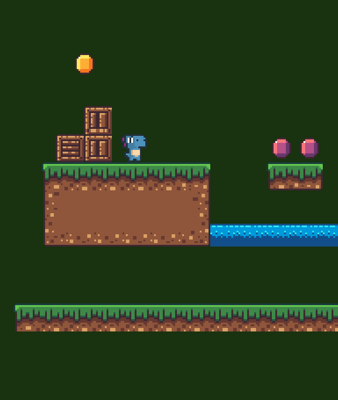

# Mario Game Appwrite
I follow along with Ania Kubów as she shows us how to make a web game.
[2hrs to code Mario with Auth + save scores | JavaScript, CSS, HTML](https://youtu.be/1CVSI3MZNNg?si=oOwU493Bz5hn1Wsw)

Made with:
- The cute dinosarus are made by [Arks Digital](https://twitter.com/ArksDigital) on [itch.io](https://arks.itch.io/dino-characters)
- The pretty world are made by [Rotting Pixels](https://twitter.com/PixelsRotting) on [itch.io](https://rottingpixels.itch.io/nature-platformer-tileset)
- ~~[Kaboom Legacy](https://legacy.kaboomjs.com/)~~ [Phaser](https://phaser.io/) for animations
- [Appwrite](https://appwrite.io/) as a database and user auth. *Similar to googels firebase.*

TODO: *(in no particular order)*
- [x] Finish tutorial
- [ ] Break up the code into different files
- [ ] Update to new
    - [x] textures
    - [ ] font and styling
- [x] Add animations
- [ ] Add a screen before starting the game
- [ ] Add a restart button on the 'lose' screen
- [ ] Show highscore for all players
- [x] Keep gems and level text inside field when playing
- [ ] Add health
- [ ] Create more levels
- [ ] Add a background

BUGS: 
- [ ] The player dies when falling onto an enemy while jumping onto them kills the enemy, as expected
- [ ] The enemies don't fall off the world as expected.
- [ ] Lines appear around the sprites, probably a rendering issue.
- [ ] Collision/rendering issue. The player keeps switching between grounded and hovering state. 

--- 

## v.0.5.0
I have really been trying to update the kaboom version from Legacy to v.3 but I keep getting these collision and rendering issues. I've asked on their forum and nobody knows how I could fix it. I managed to make it *better* but when it doens't even reach to "good" it's not good enough.

I feel like I'm fighting against the library, not with it. So I will have to find a better library since I'm doing this for *fun*.

[The branch that would have been v.0.5.0](https://github.com/MonBjo/mario-game-appwrite/tree/update-kaboom)
|   |   |
|---|---|
|||

## v.0.4.0
The tutorial by Ania is done. It was very well made and I highly recommend it! I wouldn't say it is a *finished* game but it is definitely a good base and starting point!
